<div align="center">

# 🌾 CPJ: Caption–Prompt–Judge
### *Agricultural Pest Diagnosis via Interpretable AI*

[](LICENSE)
[](https://www.python.org/)
[](README.md)
[](README.md)

**Training-Free** • **Few-Shot Learning** • **Explainable AI** • **Human-Validated**

[📊 Prompts & Evaluation](PROMPTS_AND_EVALUATION.md) • [⚙️ Configuration](CONFIGURATION.md) • [📁 Data Format](DATA_FORMAT.md)

</div>

---

## 🌟 Highlights

<table align="center">
<tr>
<td width="50%" valign="top">

### 🎯 **Key Features**

- **Training-Free Approach**
  No costly supervised fine-tuning required

- **Significant Performance Gains**
  +22.7 pp in disease classification accuracy

- **Explainable Reasoning**
  Transparent diagnostic decision-making

</td>
<td width="50%" valign="top">

### ✨ **Validation & Quality**

- **Human-Validated Results**
  94.2% agreement with expert annotators

- **Comprehensive Documentation**
  Complete prompts, criteria, and examples

- **Easy Integration**
  Few-shot learning with simple APIs

</td>
</tr>
</table>

---

## 💡 Overview

> **CPJ (Caption–Prompt–Judge)** addresses a critical challenge in agricultural AI:
> *How can we make crop disease diagnosis both accurate and interpretable?*

### ❌ Limitations of Existing Methods

- **Black-box predictions** - Provide only labels without explanation
- **High training costs** - Require supervised fine-tuning for each disease
- **Low farmer trust** - Cannot explain diagnostic decisions

### ✅ CPJ Solution

<table>
<tr>
<td width="5%">📝</td>
<td width="95%"><b>Caption Generation</b><br/>Generate interpretable descriptions of visual symptoms</td>
</tr>
<tr>
<td>🔄</td>
<td><b>Quality Refinement</b><br/>Automatically improve low-quality captions using LLM-as-a-Judge</td>
</tr>
<tr>
<td>🎯</td>
<td><b>Dual-Answer VQA</b><br/>Create complementary answers from disease and crop perspectives</td>
</tr>
<tr>
<td>⚖️</td>
<td><b>Transparent Selection</b><br/>Select best answer with explicit scoring and reasoning</td>
</tr>
</table>

---

## 🏗️ Framework Architecture

<div align="center">
  
  <p><em>Figure 1: Three-stage CPJ pipeline for explainable agricultural diagnosis</em></p>
</div>

### 🔄 Pipeline Workflow

```mermaid
graph LR
    A[📷 Input Image] --> B[📝 Step 1: Caption Enhancement]
    B --> C[🎯 Step 2: Dual-Answer VQA]
    C --> D[⚖️ Step 3: Judge Selection]
    D --> E[✅ Final Answer + Reasoning]

    style A fill:#e3f2fd
    style B fill:#fff3e0
    style C fill:#f3e5f5
    style D fill:#e8f5e9
    style E fill:#fce4ec
```



<details>
<summary><b>📋 Click to see detailed workflow</b></summary>

```
┌─────────────────────────────────────────────────────────────────┐
│  📝 STEP 1: Caption Enhancement                                 │
│  ────────────────────────────────────────────────────────────   │
│  Input: Raw agricultural image                                  │
│  Process: VLM → Generate Caption → LLM Judge → Refine if <8.0  │
│  Output: "Compound pinnate leaf with scattered necrotic         │
│           lesions (2-5mm) showing chlorotic halos..."           │
└─────────────────────────────────────────────────────────────────┘
                             ↓
┌─────────────────────────────────────────────────────────────────┐
│  🎯 STEP 2: Dual-Answer VQA Generation                          │
│  ────────────────────────────────────────────────────────────   │
│  Input: Caption + Question                                      │
│  Process: Generate two complementary perspectives               │
│  - Answer 1 (Disease Focus): Symptoms, severity, features       │
│  - Answer 2 (Crop Focus): Species, morphology, growth stage     │
└─────────────────────────────────────────────────────────────────┘
                             ↓
┌─────────────────────────────────────────────────────────────────┐
│  ⚖️ STEP 3: LLM-as-a-Judge Selection                            │
│  ────────────────────────────────────────────────────────────   │
│  Input: Two candidate answers                                   │
│  Process: Evaluate on 5 criteria (0-1 each) → Select best       │
│  Output: Selected: 4.7/5.0  |  Unselected: 3.2/5.0             │
│         + Transparent reasoning for selection                   │
└─────────────────────────────────────────────────────────────────┘
```

</details>

---

## 📊 Performance Results

### 🎯 CDDMBench Benchmark Results

<table align="center">
<thead>
  <tr>
    <th>Metric</th>
    <th>Performance</th>
    <th>Improvement</th>
  </tr>
</thead>
<tbody>
  <tr>
    <td><b>Crop Classification</b></td>
    <td><code>63.38%</code></td>
    <td><b style="color:green">+22.7 pp</b> 📈</td>
  </tr>
  <tr>
    <td><b>Disease Classification</b></td>
    <td><code>33.70%</code></td>
    <td><b style="color:green">+22.7 pp</b> 📈</td>
  </tr>
  <tr>
    <td><b>Knowledge QA Score</b></td>
    <td><code>84.5 / 100</code></td>
    <td><b style="color:green">+19.5 points</b> 📈</td>
  </tr>
</tbody>
</table>

> 💡 **All improvements measured against no-caption baseline**

### 🔬 Human Validation Results

We validated our LLM-as-a-Judge approach against expert agricultural scientists:

<table align="center">
<thead>
  <tr>
    <th width="40%">Validation Metric</th>
    <th width="60%">Result</th>
  </tr>
</thead>
<tbody>
  <tr>
    <td>🎯 <b>Agreement Rate</b></td>
    <td><code>94.2%</code></td>
  </tr>
  <tr>
    <td>📊 <b>Cohen's Kappa</b></td>
    <td><code>0.88</code> (strong agreement)</td>
  </tr>
  <tr>
    <td>📈 <b>Score Correlation</b></td>
    <td><code>r = 0.91</code></td>
  </tr>
  <tr>
    <td>🔢 <b>Sample Size</b></td>
    <td>396 cases (10% random sampling)</td>
  </tr>
</tbody>
</table>

**Quality Scores:**
- ✅ Selected answers: **4.9/5.0** (high quality)
- ⚠️ Unselected answers: **3.6/5.0** (acceptable)

---

## 📦 Dataset Information

This work uses the **CDDMBench** (Crop Disease Diagnosis Multimodal Benchmark):

- 📄 **Paper**: Liu et al., "A multimodal benchmark dataset and model for crop disease diagnosis", ECCV 2024, pp. 157–170
- 🔗 **GitHub**: [UnicomAI/UnicomBenchmark/CDDMBench](https://github.com/UnicomAI/UnicomBenchmark/tree/main/CDDMBench)
- 📊 **Test Set**: 3,000 diagnosis images + 20 knowledge QA questions

---

## 🚀 Quick Start

### 📥 Installation

```bash
# Clone the repository
git clone https://github.com/zhangwentao159357/CPJ-Agricultural-Diagnosis.git
cd CPJ-Agricultural-Diagnosis

# Install dependencies
pip install -r requirements.txt
```

### ⚙️ Configuration

Set up your API credentials in each script:

```python
import os
from langchain_openai import ChatOpenAI

# Configure API endpoint
os.environ["OPENAI_API_BASE"] = "https://api.openai.com/v1"
os.environ["OPENAI_API_KEY"] = "your-api-key-here"

# Initialize model
model = ChatOpenAI(
    model="gpt-4",          # or your preferred model
    temperature=0,          # deterministic output
    max_retries=3,
    timeout=30
)
```

> 📖 **See [CONFIGURATION.md](CONFIGURATION.md) for detailed setup instructions**

### ▶️ Run the Pipeline

Execute the three-stage pipeline:

<details>
<summary><b>Step 1: Caption Generation & Enhancement</b></summary>

```bash
cd "step1_caption_generation and refinement"

python caption_judge_optimize.py \
    --input your_images.json \
    --output refined_captions.json \
    --threshold 8.0
```

**Output**: JSON file with refined captions scoring ≥ 8.0/10.0

</details>

<details>
<summary><b>Step 2: Dual-Answer VQA Generation</b></summary>

```bash
cd step2_vqa_generation

python diagnosis_vqa.py \
    --input "../step1_caption_generation and refinement/data/refined_captions.json" \
    --output data/dual_answers.json \
    --model gpt-4
```

**Output**: JSON file with two complementary answers per question

</details>

<details>
<summary><b>Step 3: LLM-as-a-Judge Selection</b></summary>

```bash
cd step3_answer_selection

python diagnosis_judge.py \
    --input ../step2_vqa_generation/data/dual_answers.json \
    --output data/final_answers.json \
    --evaluation-output data/evaluation_results.json \
    --model gpt-4
```

**Output**: JSON file with selected answer + transparent reasoning

</details>

---

## 📖 Documentation

### 📚 Core Documentation Files

<table>
<thead>
  <tr>
    <th width="30%">Document</th>
    <th width="40%">Description</th>
    <th width="30%">Key Content</th>
  </tr>
</thead>
<tbody>
  <tr>
    <td>🔥 <a href="PROMPTS_AND_EVALUATION.md"><b>PROMPTS_AND_EVALUATION.md</b></a></td>
    <td>Complete prompt engineering details</td>
    <td>System prompts<br/>Few-shot examples<br/>Scoring rubrics<br/>Validation results</td>
  </tr>
  <tr>
    <td>⚙️ <a href="CONFIGURATION.md"><b>CONFIGURATION.md</b></a></td>
    <td>Setup and configuration guide</td>
    <td>API setup<br/>Model config<br/>Troubleshooting</td>
  </tr>
  <tr>
    <td>📋 <a href="DATA_FORMAT.md"><b>DATA_FORMAT.md</b></a></td>
    <td>Data format specifications</td>
    <td>JSON schemas<br/>Validation rules<br/>Examples</td>
  </tr>
</tbody>
</table>

### 📏 Evaluation System

#### Caption Quality Evaluation (10-Point Scale)

| Criterion | Weight | Description |
|-----------|--------|-------------|
| **Accuracy** | 0-2 | Correct identification of visual features |
| **Completeness** | 0-2 | All key elements present |
| **Detail** | 0-2 | Specific symptom descriptions |
| **Relevance** | 0-2 | Useful for diagnosis |
| **Clarity** | 0-2 | Professional language (80-120 words) |

- 🎯 **Threshold**: τ = 8.0/10.0
- 🔄 **Auto-refinement**: Applied if score < 8.0

#### Answer Quality Evaluation (5-Point Scale)

| Criterion | Weight | Description |
|-----------|--------|-------------|
| **Plant Accuracy** | 0-1 | Correct crop identification |
| **Disease Accuracy** | 0-1 | Correct disease identification |
| **Symptom Accuracy** | 0-1 | Precise symptom description |
| **Format Adherence** | 0-1 | Includes both plant AND disease ID |
| **Completeness** | 0-1 | Comprehensive and professional |

- 🎯 **Threshold**: τ = 4.0/5.0
- 📊 **Selection**: Higher total score (0-5) + transparent reasoning

> 👉 **For complete details**: See [PROMPTS_AND_EVALUATION.md](PROMPTS_AND_EVALUATION.md)

---

## 🎯 Why CPJ Works

### 1️⃣ Interpretable Captions Bridge the Information Gap

Traditional VQA models lose critical visual details. CPJ makes information explicit:

<table>
<tr>
<th width="50%">❌ Without Caption</th>
<th width="50%">✅ With CPJ Caption</th>
</tr>
<tr>
<td valign="top">

**Question**: "Is this crop diseased?"

**Answer**: "Yes"

*Problem: No explanation of reasoning*

</td>
<td valign="top">

**Caption**: "Compound pinnate leaf with scattered dark brown lesions (2-5mm) showing yellow halos..."

**Question**: "Is this crop diseased?"

**Answer**: "Yes, symptoms indicate bacterial infection with necrotic lesions..."

*Advantage: Clear diagnostic reasoning*

</td>
</tr>
</table>

### 2️⃣ Dual Answers Capture Complementary Perspectives

Different diagnostic viewpoints ensure comprehensive coverage:

```diff
+ Answer 1 (Disease Focus):
  "Bacterial infection with necrotic lesions (2-5mm).
   Key symptoms: dark brown circular spots with yellow halos,
   angular shape following vein structures, 20-30% coverage..."

+ Answer 2 (Crop Focus):
  "Compound pinnate leaf structure with serrated margins,
   typical of Solanaceae family, showing bacterial infection
   symptoms with characteristic lesion patterns..."
```

### 3️⃣ LLM-as-a-Judge Provides Transparent Selection

Every decision includes explicit scoring and reasoning:

```json
{
  "selected": "Answer 1",
  "selected_score": 4.7,
  "unselected_score": 3.2,
  "reasoning": "Answer 1 provides more specific disease symptoms
                and severity assessment, making it more actionable
                for treatment recommendations"
}
```

---

## 📁 Repository Structure

```
CPJ-Agricultural-Diagnosis/
│
├── 📝 step1_caption_generation and refinement/
│   ├── caption_generation.py           # Initial caption generation
│   ├── caption_judge_optimize.py       # Caption evaluation & refinement
│   └── data/
│       └── refined_captions_sample.json
│
├── 🎯 step2_vqa_generation/
│   ├── diagnosis_vqa.py                # Disease diagnosis VQA
│   ├── knowledge_qa_vqa.py             # Knowledge QA VQA
│   └── data/
│       └── dual_answers_sample.json
│
├── ⚖️ step3_answer_selection/
│   ├── diagnosis_judge.py              # Diagnosis answer judge
│   ├── knowledge_qa_judge.py           # Knowledge QA judge
│   └── data/
│       └── judged_answers_sample.json
│
├── 📊 dataset/                         # CDDMBench dataset
│   └── README.md
│
├── 📷 docs/                            # Documentation assets
│   └── framework.png
│
├── 📄 PROMPTS_AND_EVALUATION.md        # Detailed evaluation criteria
├── ⚙️ CONFIGURATION.md                 # Setup instructions
├── 📋 DATA_FORMAT.md                   # Data specifications
├── 📦 requirements.txt                 # Python dependencies
├── 📜 LICENSE                          # MIT License
└── 📖 README.md                        # This file
```

---

## 🔬 Reproducibility Checklist

This repository provides complete transparency for reproduction:

<table>
<tr>
<td width="50%" valign="top">

**📝 Prompts & Templates**
- ✅ Complete system prompts
- ✅ Few-shot examples
- ✅ Output format specifications

**📊 Evaluation Criteria**
- ✅ Detailed scoring rubrics (caption: 10-point, answer: 5-point)
- ✅ Threshold specifications (caption: τ = 8.0, answer: τ = 4.0)
- ✅ Selection logic documentation

**👥 Human Validation**
- ✅ Validation protocol
- ✅ Agreement metrics (94.2% agreement)
- ✅ Sample size (N = 396)

</td>
<td width="50%" valign="top">

**💻 Code & Data**
- ✅ All three pipeline stages
- ✅ Configuration examples
- ✅ Sample annotated outputs

**📖 Documentation**
- ✅ Setup guides
- ✅ Data format specifications
- ✅ Troubleshooting tips

**🔍 Failure Analysis**
- ✅ Common failure patterns
- ✅ Mitigation strategies
- ✅ Example failure cases

</td>
</tr>
</table>

---

## 👥 Contributors & Contact

<table align="center">
<tr>
<td align="center">
<b>Wentao Zhang</b><br/>
📧 <a href="mailto:1557085480@qq.com">1557085480@qq.com</a>
</td>
<td align="center">
<b>Tao Fang</b> †<br/>
📧 <a href="mailto:taofang@mmc.edu.mo">taofang@mmc.edu.mo</a>
</td>
<td align="center">
<b>Lina Lu</b> †<br/>
📧 <a href="mailto:3050651@qq.com">3050651@qq.com</a>
</td>
</tr>
<tr>
<td align="center">
<b>Lifei Wang</b><br/>
📧 <a href="mailto:wanglifei@mmc.edu.mo">wanglifei@mmc.edu.mo</a>
</td>
<td align="center">
<b>Weihe Zhong</b><br/>
📧 <a href="mailto:whzhong@mmc.edu.mo">whzhong@mmc.edu.mo</a>
</td>
<td></td>
</tr>
</table>

<p align="center"><em>† Co-corresponding authors</em></p>

---

## 📜 License

This project is licensed under the **MIT License** - see the [LICENSE](LICENSE) file for details.

---

<div align="center">

### ⭐ **Star this repository if you find it helpful!** ⭐

*Explainable agricultural pest diagnosis using large language models*
*Training-free • Human-validated • Fully documented*

**[🔝 Back to Top](#-cpj-caption-prompt-judge)**

</div>
